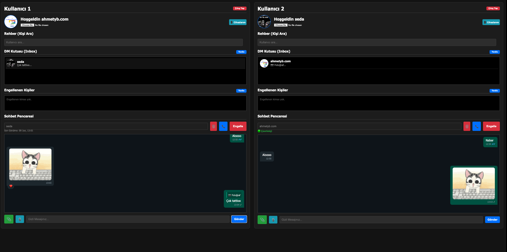

# 🔒 PRIVATE.MESSAGING.MW

> **[English](#english) | [Türkçe](#türkçe)**

---

<a name="english"></a>
## 🇬🇧 English

**An Enterprise-Grade, End-to-End Encrypted (E2EE) real-time private messaging middleware.**  
Built on ASP.NET Core 6, SignalR, MongoDB, and Redis with a clean N-Tier architecture.

### 🎯 What is this used for?
This project is designed to be the backend engine for high-security messaging applications (similar to WhatsApp, Signal, or Telegram). It handles user authentication, contact searching, message persistence, and real-time bidirectional communication. It ensures that **even the server cannot read the messages** by enforcing End-to-End Encryption (E2EE) using RSA-2048 and AES algorithms. 

Additionally, it supports WebRTC signaling for peer-to-peer Voice/Video calls, meaning audio and video streams never touch the server!

### 📸 Client Preview



---

### 📐 Architecture

The project has been refactored into a clean N-Tier Architecture to decouple business logic, API layer, and entities.

```
PRIVATE.MESSAGING.MW/
├── PRIVATE.MESSAGING.Core/       # Entities & Interfaces
├── PRIVATE.MESSAGING.DTOs/       # Request / Response models (PagedResponse, etc.)
├── PRIVATE.MESSAGING.Services/   # Business Logic (Auth, User, Chat)
├── PRIVATE.MESSAGING.MW/         # API Layer (Controllers, SignalR Hub, Middlewares)
└── PRIVATE.MESSAGING.Tests/      # xUnit & Moq based Unit Tests
```

---

### 🚀 Enterprise Features (10/10 Readiness)

#### 🔐 Authentication & Security Hardening
- **Email + OTP-based registration and login.**
- **JWT + Refresh Token Architecture:** Strict validation enabled. Access tokens expire in 15 minutes, while Refresh Tokens last for 30 days. The client automatically refreshes the token in the background, ensuring maximum security with zero user interruption.
- **Asymmetric RSA (2048-bit) + AES hybrid key management.**
- **Key pair reset support** (Requires a Recovery PIN to restore old chats).
- **OTP Rate Limiting:** Brute-force protection on OTP endpoints (Max 3 req / min).
- **Global Error Handling Middleware:** Masks stack traces and provides unified JSON error responses in production.

#### 💬 Messaging (SignalR)
- **End-to-End Encryption (E2EE):** Every message is protected by an AES key encrypted with the recipient's RSA 2048-bit public key.
- **Pagination (Page & Limit):** Endpoints that return multiple records (like Contacts and Message History) implement cursor/page-based pagination (`PagedResponse<T>`). This allows for smooth "Infinite Scrolling" on mobile/web clients.
- **WebRTC Signaling:** Real-time WebRTC SDP exchange through SignalR to initiate Peer-to-Peer encrypted voice calls.
- Real-time message delivery, Read receipts (`IsRead`, `ReadAt`), Delete for everyone, Clear chat history (Soft-delete for me only), and Emoji reaction system.

#### ⚡ Scaling & Performance (Redis)
- **Distributed Caching (Redis):** SignalR connection states and User profiles are heavily cached in Redis. This allows the API to be horizontally scaled behind a load balancer without losing track of which user is connected to which server node.

---

### 🌐 API Endpoints

#### Auth — `/api/auth`
| Method | Endpoint | Description |
|--------|----------|-------------|
| `POST` | `/register` | Register a new user (sends OTP) |
| `POST` | `/login` | Login (sends OTP) |
| `POST` | `/verify-otp` | Verify OTP, returns JWT and Refresh Token |
| `POST` | `/refresh-token` | Obtain a new JWT using the Refresh Token |
| `POST` | `/reset-keys` 🔒 | Reset RSA key pair |
| `GET` | `/publickey/{nickname}` 🔒 | Get user's public key |

#### User — `/api/user`
| Method | Endpoint | Description |
|--------|----------|-------------|
| `POST` | `/profile-picture` 🔒 | Upload / update profile picture |
| `GET` | `/{nickname}/profile` 🔒 | Get user profile |
| `GET` | `/contacts?query=&page=1&limit=50` 🔒 | Search users with pagination |
| `GET` | `/inbox?page=1&limit=50` 🔒 | DM inbox list with pagination |
| `POST` | `/block/{targetNickname}` 🔒 | Block / Unblock user |

#### Message — `/api/message`
| Method | Endpoint | Description |
|--------|----------|-------------|
| `GET` | `/history/{contactNickname}?page=1&limit=50` 🔒 | Fetch message history with pagination |
| `DELETE` | `/history/{contactNickname}` 🔒 | Clear chat (delete for me only) |

> 🔒 Requires JWT Bearer token.

---

### ⚙️ Configuration & Prerequisites

You must have **MongoDB** and **Redis** running.

Add the following sections to `appsettings.json` or `appsettings.Development.json`:

```json
{
  "MongoDbSettings": {
    "ConnectionString": "mongodb://localhost:27017",
    "DatabaseName": "PrivateMessagingDb"
  },
  "RedisCacheOptions": {
    "Configuration": "localhost:6379",
    "InstanceName": "PrivateMessaging_"
  },
  "SmtpSettings": {
    "Host": "smtp.example.com",
    "Port": 587,
    "Username": "your@email.com",
    "Password": "your-password",
    "FromName": "Private Messaging"
  },
  "Jwt": {
    "Key": "your-super-secret-key-minimum-32-chars",
    "Issuer": "PrivateMessagingMW",
    "Audience": "PrivateMessagingClient",
    "AccessTokenExpirationMinutes": 15,
    "RefreshTokenExpirationDays": 30
  }
}
```

---

### 🏃 Running & Testing

**1. Start Database & Cache (Docker):**
```bash
# Start MongoDB
docker run --name private-mongo -p 27017:27017 -d mongo

# Start Redis
docker run --name private-redis -p 6379:6379 -d redis
```

**2. Run the API:**
```bash
cd PRIVATE.MESSAGING.MW/PRIVATE.MESSAGING.MW
dotnet restore
dotnet run
```

**3. Run Unit Tests (27/27 Passing):**
```bash
cd PRIVATE.MESSAGING.MW
dotnet test
```

---
---

<a name="türkçe"></a>
## 🇹🇷 Türkçe

**Kurumsal Seviyede (Enterprise-Grade), Uçtan uca şifreli (E2EE) gerçek zamanlı özel mesajlaşma altyapısı.**  
ASP.NET Core 6, SignalR, MongoDB ve Redis üzerine inşa edilmiş, N-Tier (Katmanlı) mimariye sahip bir middleware projesidir.

### 🎯 Ne için kullanılır?
Bu proje; yüksek güvenlikli mesajlaşma uygulamalarının (WhatsApp, Signal, Telegram benzeri) arka plan (backend) motoru olarak tasarlanmıştır. Kullanıcı kimlik doğrulamasını, iletişim aramalarını, gerçek zamanlı çift yönlü veri aktarımını yönetir. Uçtan uca şifreleme (E2EE) sayesinde, **sunucunun dahi atılan mesajları okuyamaması** garanti edilir.

Ayrıca SignalR üzerinden WebRTC SDP takasını yöneterek, kullanıcıların sunucuya ses/görüntü aktarmadan birbirleriyle doğrudan Peer-to-Peer sesli görüşme yapabilmelerine olanak tanır!

### 📸 İstemci Önizleme


---

### 📐 Mimari

Proje, iş mantığını, API katmanını ve veritabanı varlıklarını birbirinden ayırmak amacıyla N-Tier (Katmanlı) Mimari'ye geçirilmiştir.

```
PRIVATE.MESSAGING.MW/
├── PRIVATE.MESSAGING.Core/       # Varlıklar (Entities) ve Arayüzler (Interfaces)
├── PRIVATE.MESSAGING.DTOs/       # İstek/Yanıt modelleri (PagedResponse vb.)
├── PRIVATE.MESSAGING.Services/   # İş mantığı (Business Logic)
├── PRIVATE.MESSAGING.MW/         # API Katmanı (Controllers, SignalR Hub, Middleware)
└── PRIVATE.MESSAGING.Tests/      # xUnit ve Moq tabanlı Birim Testleri
```

---

### 🚀 Kurumsal Özellikler (10/10 Readiness)

#### 🔐 Kimlik Doğrulama & Güvenlik Sıkılaştırması
- **E-posta + OTP tabanlı kayıt ve giriş.**
- **JWT + Refresh Token Mimarisi:** Kısa ömürlü JWT token (15 dakika) ve uzun ömürlü Refresh Token (30 Gün) sistemi kurulmuştur. Mobil veya web istemci, 15 dakika dolmadan arka planda sessizce token yeniler ve kullanıcıya kesintisiz / ultra güvenli bir deneyim sunar.
- **Asimetrik RSA (2048-bit) + AES hibrit şifreleme ile anahtar yönetimi.**
- **Parola/anahtar sıfırlama desteği.**
- **OTP Rate Limiting:** Kaba kuvvet (brute-force) saldırılarına karşı koruma (Dakikada maks. 3 istek).
- **Global Error Handling Middleware:** Üretim ortamında (production) sunucu hatalarını (stack-trace) gizleyerek dışarıya kontrollü JSON sızdırmazlığı sağlar.

#### 💬 Mesajlaşma (SignalR)
- **Uçtan Uca Şifreleme (E2EE):** Her mesaj, alıcının RSA 2048-bit public key'i ile şifrelenen AES anahtarıyla korunur.
- **Sayfalama (Pagination):** Rehber (Contacts) ve Mesaj Geçmişi (History) gibi çok veri dönebilecek endpoint'lere Cursor/Page tabanlı sayfalama özelliği eklendi (`PagedResponse<T>`). Böylelikle ön yüzde Infinite Scroll (Sonsuz Kaydırma) yapılabilir.
- **WebRTC Sinyalizasyon:** Uçtan uca şifreli sesli aramaları başlatmak için WebRTC sinyalizasyon komutları desteklenmektedir.
- Gerçek zamanlı mesaj iletimi, okundu bilgisi, herkesten silme, sohbeti temizleme ve emoji reaksiyonları.

#### ⚡ Ölçeklendirme ve Performans (Redis)
- **Dağıtık Önbellekleme (Distributed Caching):** SignalR bağlantı durumları (Connection IDs) ve Kullanıcı profilleri Redis üzerinde önbelleklenir. Bu sayede uygulama yatay olarak (Horizontal Scaling) birden fazla sunucuda çalıştırıldığında dahi kullanıcıların durumları ortak Redis sunucusundan okunarak veri kaybı / bağlantı kopması önlenir.

---

### 🌐 API Endpointleri

#### Auth — `/api/auth`
| Method | Endpoint | Açıklama |
|--------|----------|----------|
| `POST` | `/register` | Yeni kullanıcı kaydı (OTP gönderir) |
| `POST` | `/login` | Giriş (OTP gönderir) |
| `POST` | `/verify-otp` | OTP doğrulama, JWT ve Refresh Token döner |
| `POST` | `/refresh-token` | Refresh Token ile yeni bir JWT döner |
| `POST` | `/reset-keys` 🔒 | RSA anahtar çifti sıfırlama |
| `GET` | `/publickey/{nickname}` 🔒 | Kullanıcının public key'ini getirir |

#### User — `/api/user`
| Method | Endpoint | Açıklama |
|--------|----------|----------|
| `POST` | `/profile-picture` 🔒 | Profil resmi yükleme/güncelleme |
| `GET` | `/{nickname}/profile` 🔒 | Kullanıcı profili getirme |
| `GET` | `/contacts?query=&page=1&limit=50` 🔒 | Sayfalamalı kullanıcı arama |
| `GET` | `/inbox?page=1&limit=50` 🔒 | Sayfalamalı DM kutusu listesi |
| `POST` | `/block/{targetNickname}` 🔒 | Kullanıcı engelleme / kaldırma |

#### Message — `/api/message`
| Method | Endpoint | Açıklama |
|--------|----------|----------|
| `GET` | `/history/{contactNickname}?page=1&limit=50` 🔒 | Sayfalamalı mesaj geçmişi |
| `DELETE` | `/history/{contactNickname}` 🔒 | Mesaj geçmişini temizle (benden sil) |

> 🔒 JWT token gerektirir.

---

### ⚙️ Yapılandırma ve Kurulum Ön Koşulları

Sistemde **MongoDB** ve **Redis** kurulu ve çalışıyor olmalıdır.

`appsettings.json` veya `appsettings.Development.json` dosyasına aşağıdaki bölümleri ekleyin:

```json
{
  "MongoDbSettings": {
    "ConnectionString": "mongodb://localhost:27017",
    "DatabaseName": "PrivateMessagingDb"
  },
  "RedisCacheOptions": {
    "Configuration": "localhost:6379",
    "InstanceName": "PrivateMessaging_"
  },
  "SmtpSettings": {
    "Host": "smtp.example.com",
    "Port": 587,
    "Username": "your@email.com",
    "Password": "your-password",
    "FromName": "Private Messaging"
  },
  "Jwt": {
    "Key": "your-super-secret-key-minimum-32-chars",
    "Issuer": "PrivateMessagingMW",
    "Audience": "PrivateMessagingClient",
    "AccessTokenExpirationMinutes": 15,
    "RefreshTokenExpirationDays": 30
  }
}
```

---

### 🏃 Çalıştırma & Test Etme

**1. Veritabanı ve Redis'i Çalıştırın (Docker):**
```bash
# MongoDB
docker run --name private-mongo -p 27017:27017 -d mongo

# Redis
docker run --name private-redis -p 6379:6379 -d redis
```

**2. Uygulamayı Çalıştırmak İçin:**
```bash
cd PRIVATE.MESSAGING.MW/PRIVATE.MESSAGING.MW
dotnet restore
dotnet run
```
İstemciye erişmek için: Tarayıcıdan `test-client.html` dosyasını Live Server yardımıyla açabilirsiniz.

**3. Birim Testlerini (Unit Tests) Çalıştırmak İçin:**
```bash
cd PRIVATE.MESSAGING.MW
dotnet test
```
Tüm testlerin başarıyla (`Passed: 27`) tamamlandığını göreceksiniz.
